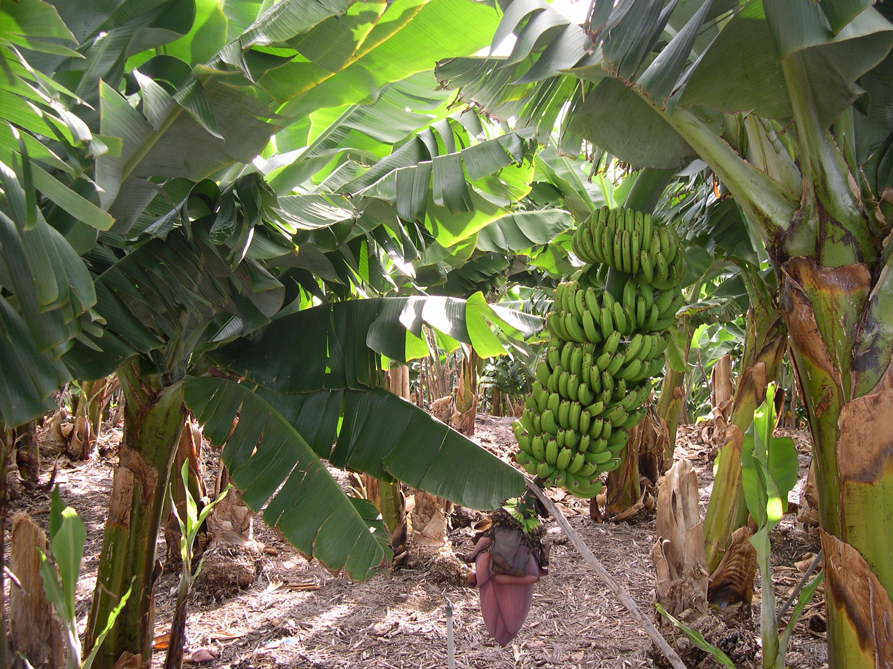
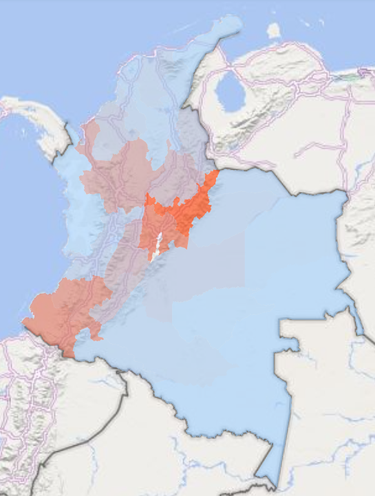
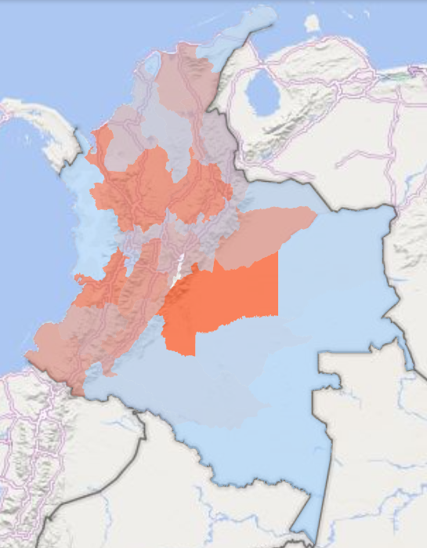
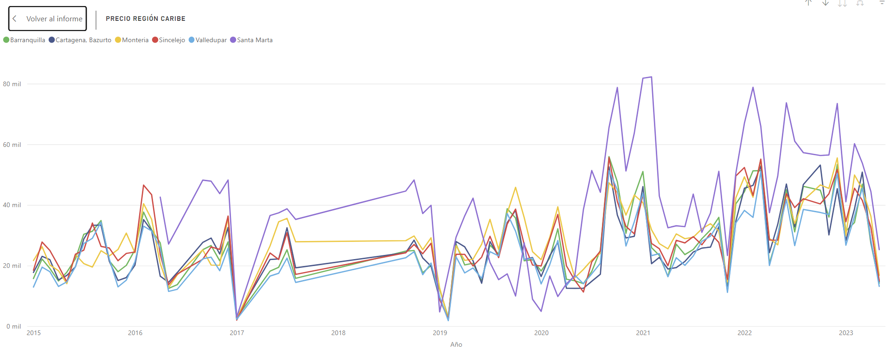
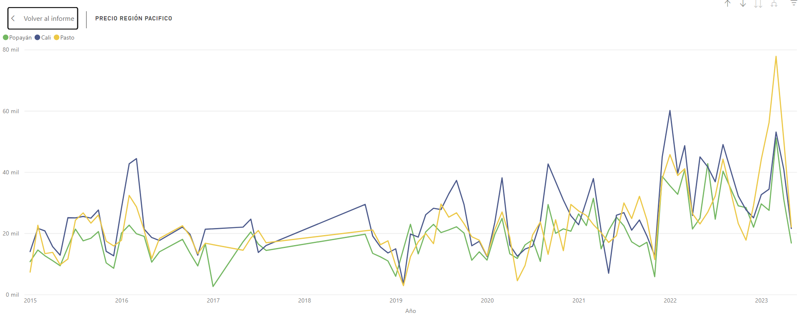
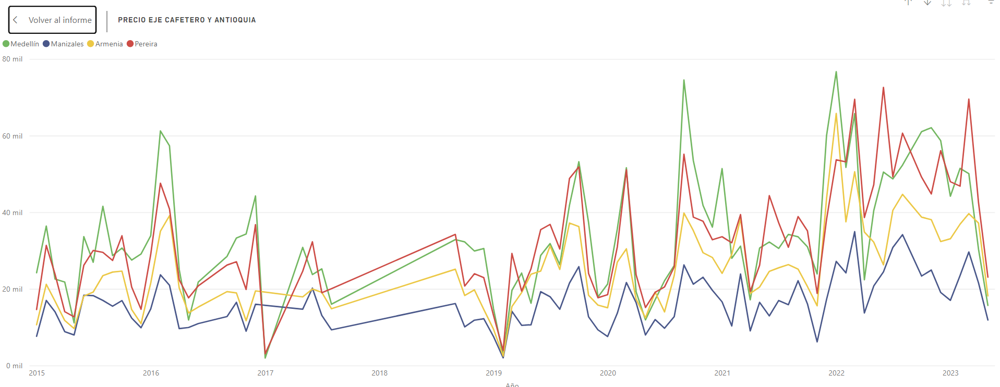
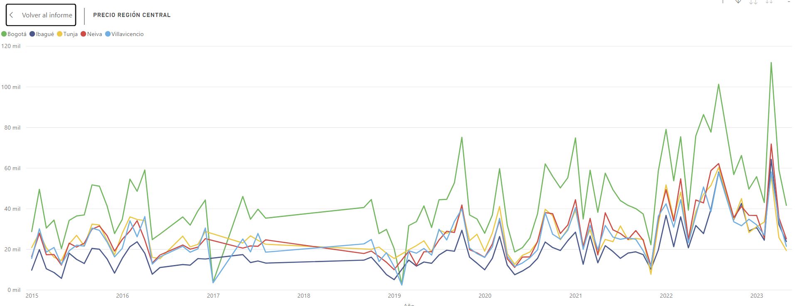
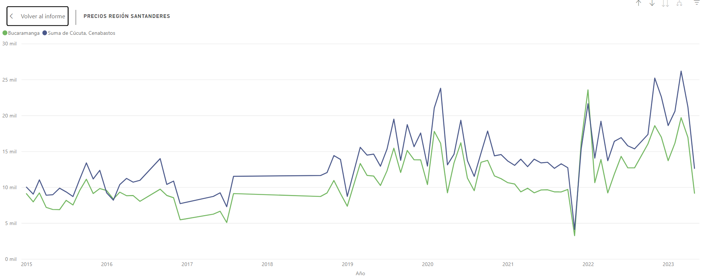

<h1>
  
</h1>
<h1 style="text-align: center;">Caracterización agraria y comportamiento de los precios 2015-2023</h1>

## Motivación
<h1>
</h1>
Colombia es un país con una amplia vocación agrícola debido a que cuenta con una amplia extensión territorial para la realización de estas actividades y cuenta con diferentes pisos térmicos y una gran diversidad lo que hace que el campo y la agricultura una oportunidad para no solo abastecer el mercado interno, si no además explorar los mercados internacionales con sus productos. 

Por este motivo es de vital importancia entender las dinámicas de como funciona el campo colombiano asi como las debilidades, fortalezas y oportunidades que hay en busca de mejorar las oportunidades de ingreso de los campesinos y la posibilidad de generar más cadenas de valor agregado en busca de sustituir productos que normalmente son importados y poder abrir nuevas oportunidades de mercado. 

Por otro lado los precios de los alimentos representan un rubro muy importante dentro de los gastos de las familias de bajos recursos o en condición de vulnerabilidad por lo tanto en este trabajo se busca conocer las dinámicas de los precios de los alimentos en las centrales mayoristas. 

Este trabajo es una primera aproximación debido a que le faltan varios pasos para conectar los diferentes temas que se trabajan aquí y otros adicionales como es el precio de los insumos agrícolas esenciales en la producción y que tienen una gran influencia en los precios.
## Datos y métodos
<h1>
</h1>

Los datos para este proyecto provienen de los datos de la Encuesta Nacional Agropecuaria (ENA) para el año 2019. Y de los reportes de precios del SIPSA para las principales centrales mayoristas de Colombia.

+ SIPSA: <https://www.dane.gov.co/index.php/estadisticas-por-tema/agropecuario/sistema-de-informacion-de-precios-sipsa/componente-precios-mayoristas>
+ ENA (2019): <https://www.dane.gov.co/index.php/estadisticas-por-tema/agropecuario/encuesta-nacional-agropecuaria-ena>

Los datos de la encuesta nacional agropecuaria se descargaron directamente mientra que para los datos del SIPSA se utilizó webscrapping para descargar los anexos diarios.

Para descargar los anexos diarios se uso la librería selenium en python. En primer lugar se identificaron los XPATH para redirigir el navegador abriendo una nueva pestaña para cada mes de cada año. En esa nueva pestaña se buscaba los archivos a descargar listando todos los archivos que cumplieran con el requisito de nombre y extensión para luego dar click en los enlaces y empezara a descargar directamente en un folder previamente especificado, luego cerrar esa ventana y volver a la principal para abrir una nueva ventana con el mes siguiente.

+ Nota: Para más información sobre este proceso revisar archivo srapping_excels.ipynb.

En este ejercicio se descargaron más de 1600 anexos de precios los cuales se procesaron con python usando la librería pandas principalmente. Se transformaron los dataframes para tener solo la información de interés y se unieron para formar una sola base de datos.

+ Nota 1: Para más información revisar archivo Merge_reports.ipynb
+ Nota 2: Algunas modificaciones pequeñas alguno de los reportes se hicieron manualmente en excel por simplicidad (cambiar una fecha, corregir un formato especial, entre otras).
+ Nota 3: Fuera de este ejercicio quedaron un total de 8 archivos los cuales no se pudieron procesar debido a un formato totalmente diferente en los reportes por lo cual se decidió excluirlos del ejercicio. Reportes para 8 días en noviembre de 2021.

Luego se transformó la base de datos para que esta pueda ser leída de manera correcta en los análisis que se hicieron y se intentaron hacer posteriormente completando la base de con los días faltantes como missing values.

+ Nota: Para más información revisar el archivo Transform_data.ipynb

En primer lugar los datos fueron procesados en PowerBI para crear los mapas y gráficos. En los mapas se puede observar la organización por departamento de las actividades agrícolas y la participación que tienen. Adicional una medida de concentración de la tierra y la infraestructura agropecuaria. Y se puede observar como se comportan los precios en el periodo seleccionado para cada producto.

## Resultados y conclusiones
<h1>
</h1>

  

    <h3 style="text-align: center;">Total UPA por región</h3>
    
  

  

    <h3 style="text-align: center;">Total hectáreas de producción agrícola</h3>
    
  

Como parte de los resultados y como resumen del trabajo realizado en los dos mapas mostrados anteriormente podemos encontrar el número de unidades de producción agropecuaria por región y el total de hectáreas de uso agrícola en el país. Se puede observar que en la rivera del rio magdalena, Nariño, Cauca, Boyacá y Antioquia se concentra una mayor proporción de las unidades de producción agrícola, por otro lado los departamentos con mayor número de hectáreas de uso agrícola son el Meta, Antioquia, Santander y Valle. A partir de este mapa podemos notar que más allá del aporte agrícola de los llanos orientales la actividad se concentra a lo largo de los causes del rio Magdalena y el rio Cauca. 

Aquí listamos otros resultados provenientes de los diferentes mapas: 

+ El aporte de los llanos orientales (Meta y Casanare) eb la actividad agrícola es principalmente en la actividad pecuaria y cultivos transitorios y barbecho. 

+ El departamento de Boyacá a pesar de tener un gran número de UPA, no se encuentra entre los departamentos con mayor uso de suelo para actividades agrícolas y el tamaño de estas unidades de producción agrícola es de menos de una hectárea en promedio. 

+ El departamento del Valle, Antioquia y Santander son los que concentran mayor número de hectáreas en cultivos permanentes. 

Por otro lado, al revisar el comportamiento de los precios a pesar de que las series presentan una cantidad considerable de valores faltantes se observa que por región los precios tienen tendencias conjuntas, por lo cual tienen comportamientos similares y son afectados por los  mismos choques. Dentro de los productos se observa que algunos conservan aun la tendencia a la alza desde 2021 mientras otros empezaron el descenso en sus precios. En las siguientes gráficas se muestra lo anteriormente descrito para un producto. 

  
  

  
  

  

Nota: Para observar los mapas y gráficas en mayor detalle se puede revisar el siguiente informe en PowerBI publicado en la web: https://app.powerbi.com/view?r=eyJrIjoiYzc4ODRkZDktNjY1MC00YzJiLThiNzQtYzU2ZjYzYzBiMzRlIiwidCI6ImFlNTI1NzU3LTg5YmEtNGQzMC1hMmY3LTQ5Nzk2ZWY4YzYwNCIsImMiOjR9&pageName=ReportSectiondbfc78a419471189e5b1

## Próximos pasos
<h1>
</h1>

+ Realizar la labor pero no desde los reportes, desde los boletines diarios donde se hacen dos rondas de precios. Se encuentra información más completa de una gama mayor de productos. 

+ Tratar de estimar un panel con los precios probando cointegración y luego estimar una proyección de los precios para predecir como evolucionarán en el futuro cercano.

+ Análisis de los precios de los insumos.

+ Buscar más información sobre la agroindustria y la falta de cadenas de valor agregado en la producción agrícola.

